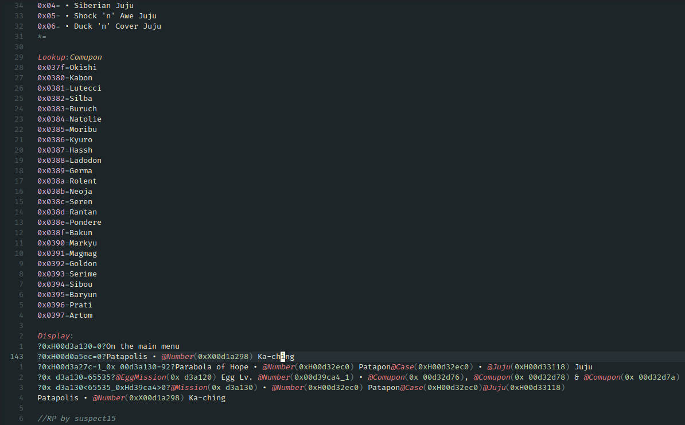

# rapresence.nvim

Neovim plugin for RetroAchievement Rich Presence script syntax highlight   
See [tree-sitter-rapresence](https://github.com/KiliLoje/tree-sitter-rapresence) for the tree-sitter grammar

## setup

I have no idea how to set it up for anything else than lazy.nvim   
anyways :
```lua
{
  "KiliLoje/rapresence.nvim",

  dependencies = {
    "nvim-treesitter/nvim-treesitter",
  },

  config = function()
    require("rapresence").setup()
  end,
}
```
Then run the following commands :
```
:TSUpdate
```
```
:TSInstall rapresence
```
and you should be good to go   

---

I will probably try to add some sort of LSP at some point, but for now this is just a syntax highlighter   

here's how it looks :

